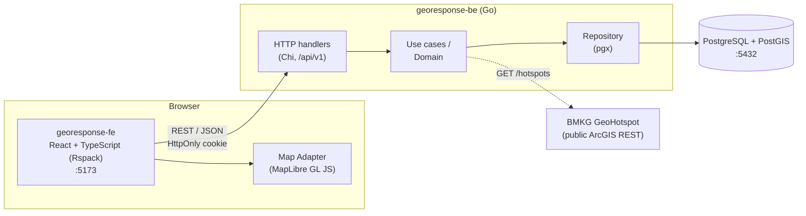
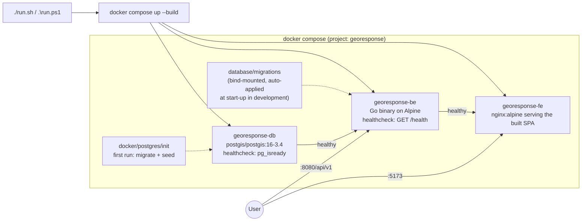
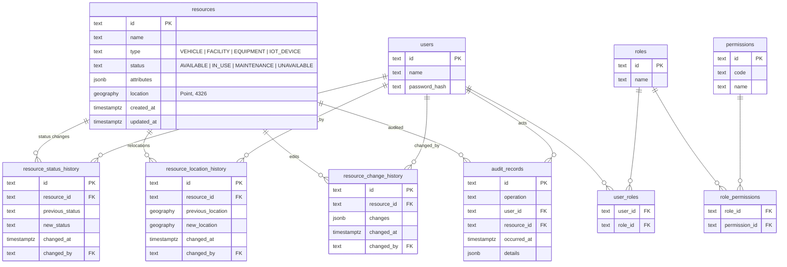
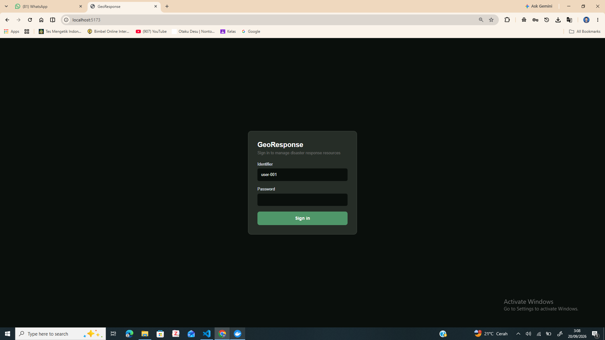
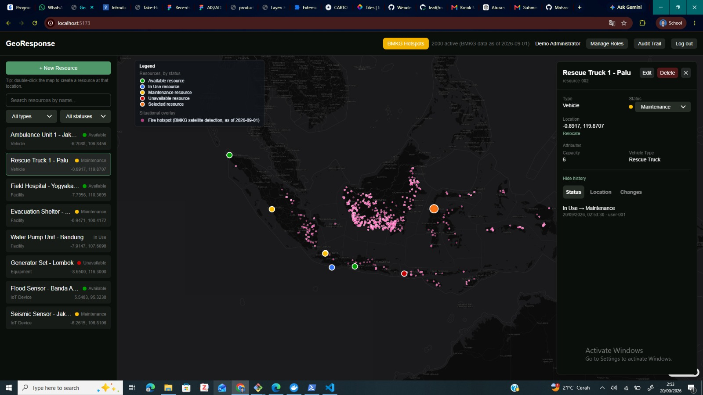

<div align="center">
  <h1>🗺️ GeoResponse</h1>
  <p><strong>Geospatial resource management for disaster response</strong></p>
  <p>Vehicles · Facilities · Equipment · IoT Devices — every resource with a status and a location on the map.</p>
</div>

###

<div align="center">
  
  
  
  
  
  
</div>

## Table of Contents

1. [Architecture Overview](#architecture-overview)
   - [Local Project Architecture](#local-project-architecture)
   - [Docker Project Architecture](#docker-project-architecture)
   - [Database Schema](#database-schema)
2. [About GeoResponse](#about-georesponse)
3. [Implementation Status](#implementation-status)
4. [Demo Accounts](#demo-accounts)
5. [Demo Screenshots](#demo-screenshots)
6. [Contributors](#contributors)
6. [Technologies We Use](#technologies-we-use)
7. [Setup](#setup)
8. [Installation (Docker — one command)](#installation-docker)
9. [Installation (Local)](#installation-local)
10. [Testing](#testing)
11. [Repository Structure](#repository-structure)
12. [Documentation](#documentation)
13. [AI-Assisted Development](#ai-assisted-development)
14. [License](#license)

<h2 id="architecture-overview">Architecture Overview</h2>

GeoResponse is a **modular monolith**: one React + TypeScript frontend, one Go
backend, one PostgreSQL + PostGIS database, with a single direction of
dependency. Full detail:
[`docs/03_architecture/SYSTEM_ARCHITECTURE.md`](docs/03_architecture/SYSTEM_ARCHITECTURE.md).

<h3 id="local-project-architecture">Local Project Architecture</h3>



<h3 id="docker-project-architecture">Docker Project Architecture</h3>



<h3 id="database-schema">Database Schema</h3>



Migrations and seeds live in [`database/`](database/); the full schema is
specified in [`docs/08_database/DATABASE_SCHEMA.md`](docs/08_database/DATABASE_SCHEMA.md).

###

<h1 id="about-georesponse">About GeoResponse</h1>
<p>During disaster response operations, having accurate and structured information about available resources — vehicles, facilities, equipment, IoT devices — is critical to understanding operational conditions. Without a centralized, structured system, it is hard to know what is available, where it is, and what condition it is in.</p>
<p>GeoResponse provides a single system for managing <strong>Resource</strong> records — each with an identity, type, type-specific attributes, operational status, and geographic location — and treats location as a first-class part of the data model rather than an afterthought. It is built with <strong>React + TypeScript</strong> (Rspack) on the frontend, <strong>Go</strong> on the backend, and <strong>PostgreSQL + PostGIS</strong> as the database. GeoResponse allows users to:</p>
<ul>
  <li>Main view: every resource on an interactive MapLibre map and in a synchronised list, with search by name and filters by type and status.</li>
  <li>Resource details: attributes, current status, coordinates, and the full status / location / change history of a resource.</li>
  <li>CRUD: create (from a form or by double-clicking the map), update, and delete resources with backend-authoritative validation.</li>
  <li>Status tracking: move a resource between <code>AVAILABLE</code>, <code>IN_USE</code>, <code>MAINTENANCE</code>, and <code>UNAVAILABLE</code>.</li>
  <li>Relocation: change a resource's location while preserving its identity, type, and history.</li>
  <li>Authentication and authorization: cookie-based login, roles and permissions management, and per-operation access checks (a read-only coordinator role is seeded).</li>
  <li>Audit trail: every write is recorded and browsable, filterable by user and resource.</li>
  <li>Situational awareness: an optional overlay of BMKG GeoHotspot fire hotspots on the same map.</li>
</ul>
<p>The product rationale, users, and scope are in <a href="docs/01_product/PRODUCT_CONTEXT.md"><code>docs/01_product/PRODUCT_CONTEXT.md</code></a>; the precise definition of a Resource and its lifecycle is in <a href="docs/01_product/DOMAIN_MODEL.md"><code>docs/01_product/DOMAIN_MODEL.md</code></a>.</p>

<h2 id="implementation-status">Implementation Status</h2>

GeoResponse is implemented end to end and runs with one command
(`./run.sh` / `.\run.ps1`, see [Installation (Docker)](#installation-docker)):

- **Backend** (`georesponse-be/`) — the full `/api/v1` surface in
  `docs/04_contracts/API_CONTRACT.md`: resource CRUD, status change,
  relocation, history, search/filter/pagination, cookie-based
  authentication, role/permission management, audit trail, the BMKG
  GeoHotspot overlay endpoint, and `GET /health`. Configuration is
  validated at start-up (the process refuses to start on a missing or
  malformed variable), and in `APP_ENV=development` pending migrations are
  applied automatically before the port is bound.
- **Frontend** (`georesponse-fe/`) — login, resource list + MapLibre map
  (behind the Map Adapter), search/filter, detail card, create (form or
  double-click on the map), update, status change, relocate, delete,
  history view, role management, audit trail view, and the hotspot overlay.
- **Database** (`database/`) — seven migration pairs and three seed files
  (sample resources plus two demo accounts, see `AKUN.md`).
- **Containerization** — real multi-stage `Dockerfile`s for both apps, a
  root `docker-compose.yml` (PostGIS with first-run migration + seeding,
  backend with healthcheck, nginx-served frontend), `run.sh`/`run.ps1`, and
  the `scripts/docker/` and `scripts/deployment/` script pairs.
- **Tests** — unit tests colocated with the code (Go `testing`; Vitest +
  React Testing Library), an API integration suite under
  `tests/integration/` (runs in CI against a PostGIS service container),
  and a Playwright golden-path e2e test under `tests/e2e/` (run locally
  against the composed stack; see `tests/README.md`).
- **CI** — `.github/workflows/ci.yml`: frontend lint/type-check/build/test,
  backend fmt/vet/build/test, the integration job, and Docker image build
  verification for both images.

Intentionally not implemented at this scope, per
`docs/01_product/SCOPE.md` and `docs/05_engineering/TECHNOLOGY_SELECTION.md`
section 17: any deployment to a hosted environment, continuous deployment,
TLS termination, a container registry, and the e2e suite as a CI stage.
Three functional items are partial (role create/rename/delete is API-only,
the list and map show only the first page of 20 resources, and the map has
no dedicated empty state) and a few endpoint-level contract deviations
exist; both are itemized in `docs/01_product/SCOPE.md` section 11 and
`docs/04_contracts/API_CONTRACT.md` section 19. The
exact, checkbox-level state of every phase — including which verification
steps were run in which environment — is tracked in
`IMPLEMENTATION_CHECKLIST.md`. This status is disclosed here, consistent
with the take-home brief's requirement to document any incomplete feature,
rather than left implicit.

<h2 id="demo-accounts">Demo Accounts</h2>
<p>There is no hosted demo; run the stack locally (one command, see below) and open <a href="http://localhost:5173">http://localhost:5173</a>. The database is seeded with two local-development-only accounts (see <a href="AKUN.md"><code>AKUN.md</code></a>):</p>

<p><strong>As an Administrator</strong> (full access):</p>
<ul>
  <li><strong>Identifier:</strong> user-001</li>
  <li><strong>Password:</strong> ChangeMe123!</li>
</ul>

<p><strong>As a Response Coordinator</strong> (read-only — every write is correctly refused with 403):</p>
<ul>
  <li><strong>Identifier:</strong> user-002</li>
  <li><strong>Password:</strong> ChangeMe123!</li>
</ul>

<h2 id="demo-screenshots">Demo Screenshots</h2>
<p>Login screen and the main map + resource list view, running locally at <a href="http://localhost:5173">http://localhost:5173</a>:</p>
<div align="center">
  
  
</div>

### <h1 id="contributors" align="center">🌟 Contributors 🌟</h1>
<div align="center">
  <table border="0">
    <tr>
      <td align="center">
        <a href="https://github.com/MahardikaPratama">
          
        </a>
        <br>
        <a href="https://github.com/MahardikaPratama" style="color:#4caf50; font-weight: bold; text-decoration: none;">Mahardika Pratama</a>
      </td>
    </tr>
  </table>
  <p>Built as a take-home technical test, with agentic AI assistance under human direction (see <a href="#ai-assisted-development">AI-Assisted Development</a>).</p>
</div>

### <h1 id="technologies-we-use" align="center">🚀 Technologies We Use 🚀</h1>
<div align="center">
  <div style="display: flex; flex-wrap: wrap; justify-content: center; gap: 10px;">
    
    
    
    
    
    
    
    
    
    
    
    
    
    
    
    
    
    
  </div>
</div>

| Area | Technology | Why |
|---|---|---|
| Frontend | React + TypeScript | Mandatory requirement |
| Build Tool | Rspack | Fast dev server and production bundling |
| Map | MapLibre GL JS | Selected via a controlled benchmark against Leaflet and OpenLayers — see `geo-map-benchmark/` |
| Server State | TanStack Query | Caching, refetching, and mutation lifecycle for API data |
| Client State | React `useState` / `useReducer` | Sufficient for local UI state; no global store needed |
| Styling | CSS (Tailwind CSS v4) | Low dependency overhead, sufficient for the app's scope |
| Frontend Testing | Vitest + React Testing Library | Component and behavior testing |
| Backend | Go | Mandatory requirement |
| HTTP Routing | Chi + `net/http` | Lightweight routing on top of the Go standard library |
| API | REST + JSON at `/api/v1` | Resource-oriented CRUD, directly consumable by the browser |
| Database | PostgreSQL + PostGIS | Relational storage with dedicated geospatial query support |
| Backend Testing | Go `testing` | Native, no extra dependency |

Full rationale, alternatives considered, and explicit non-goals (no gRPC as
the primary API, no microservices, no Kubernetes, no Redis, no message
brokers) are documented in
[`docs/05_engineering/TECHNOLOGY_SELECTION.md`](docs/05_engineering/TECHNOLOGY_SELECTION.md).
The map library was chosen by the controlled benchmark in
[`geo-map-benchmark/`](geo-map-benchmark/README.md), a standalone sub-project
that is not part of the running application.

### <h1 id="setup" align="center">Setup</h1>
<p>Follow the steps below to set up the application:</p>

<ol>
  <li><strong>Clone the repository:</strong>
    <pre><code>git clone https://github.com/MahardikaPratama/georesponse.git
cd georesponse</code></pre>
  </li>
  <li><strong>Environment files.</strong> There are three <code>.env.example</code> files — at the root (compose-level), in <code>georesponse-fe/</code>, and in <code>georesponse-be/</code>. <code>./run.sh</code> / <code>.\run.ps1</code> copy each one to <code>.env</code> automatically if it does not exist yet, so for the Docker path there is <strong>nothing to do</strong>. For the local path, copy them yourself:
    <pre><code>cp .env.example .env
cp georesponse-fe/.env.example georesponse-fe/.env
cp georesponse-be/.env.example georesponse-be/.env</code></pre>
  </li>
  <li><strong>Adjust values only if a default conflicts with your machine</strong> (e.g. a port already in use). The defaults are obviously-fake local-development placeholders; <code>.env</code> files are gitignored and must never be committed. Every variable is documented in <a href="docs/11_devops/ENVIRONMENT_MANAGEMENT.md"><code>docs/11_devops/ENVIRONMENT_MANAGEMENT.md</code></a>.</li>
</ol>

### <h1 id="installation-docker" align="center">Installation (Docker — one command)</h1>
<p>Ensure you have Docker installed and running (Docker Desktop, or Docker Engine with the Compose v2 plugin). Download it <a href="https://www.docker.com/products/docker-desktop" target="_blank">here</a>. Nothing else is required.</p>

<pre><code>./run.sh        # macOS / Linux</code></pre>
<pre><code>.\run.ps1       # Windows (PowerShell)</code></pre>

<p>The script checks Docker, creates the <code>.env</code> files if missing, builds both images, starts PostgreSQL + PostGIS → backend → frontend (each waiting for the previous one to be healthy), migrates and seeds the database on a brand-new volume, and prints the URLs:</p>

| What | URL |
|---|---|
| Frontend | http://localhost:5173 |
| Backend API | http://localhost:8080/api/v1 |
| Health check | http://localhost:8080/health |

<p>Useful variants:</p>
<pre><code>./run.sh --foreground      # stay attached to the compose logs (.\run.ps1 -Foreground)
./run.sh --down            # stop the stack, keep the database volume (.\run.ps1 -Down)
docker compose down -v     # stop and drop the database volume (next run re-migrates and re-seeds)
docker compose up --build  # the same stack without the wrapper</code></pre>

<p>What the wrapper does under the hood is documented in <a href="docs/11_devops/DOCKER_COMPOSE.md"><code>docs/11_devops/DOCKER_COMPOSE.md</code></a>; the images in <a href="docs/11_devops/CONTAINERIZATION.md"><code>docs/11_devops/CONTAINERIZATION.md</code></a>.</p>

### <h1 id="installation-local" align="center">Installation (Local)</h1>
<p>Make sure you have the following software installed on your computer:</p>

<ul>
  <li><strong>Go 1.26+</strong> — download it from <a href="https://go.dev/dl/" target="_blank">here</a>.</li>
  <li><strong>Node.js 20+ and npm</strong> — download it from <a href="https://nodejs.org/en/download/" target="_blank">here</a>.</li>
  <li><strong>PostgreSQL 15+ with the PostGIS extension</strong> — download it from <a href="https://www.postgresql.org/download/" target="_blank">here</a>, or simply run only the database from the compose file (recommended):
    <pre><code>docker compose up -d georesponse-db</code></pre>
  </li>
</ul>

<p>Then, after the <a href="#setup">Setup</a> step, in two terminals:</p>

<pre><code>cd georesponse-be
set -a && source .env && set +a     # load .env into the shell (PowerShell: see georesponse-be/README.md)
go run ./cmd/api                    # applies pending migrations, then serves on :8080</code></pre>

<pre><code>cd georesponse-fe
npm install
npm run dev                         # http://localhost:5173 with hot reload</code></pre>

<p>If you use a native PostgreSQL instead of the compose database, apply the schema and seeds once with the scripts (they need the <code>migrate</code> CLI and <code>psql</code>):</p>
<pre><code>scripts/database/migrate.sh         # Windows: scripts\database\migrate.ps1
scripts/database/seed.sh            # Windows: scripts\database\seed.ps1</code></pre>

<p>Per-application detail: <a href="georesponse-be/README.md"><code>georesponse-be/README.md</code></a>, <a href="georesponse-fe/README.md"><code>georesponse-fe/README.md</code></a>. A one-page version of all of this is <a href="QUICK_START.md"><code>QUICK_START.md</code></a>.</p>

<h2 id="testing">Testing</h2>

```bash
scripts/dev/test.sh                                              # frontend + backend unit tests (test.ps1 on Windows)
GEORESPONSE_API_URL=http://localhost:8080 scripts/dev/test.sh    # …plus tests/integration/ against a running stack
cd tests/e2e && npm install && npm run install-browsers && npm test   # Playwright golden path (needs a running stack)
scripts/quality/check.sh                                         # every quality gate (lint, type-check, build, vet, test)
```

Unit tests are colocated with the code; `tests/integration/` (Go, black-box
HTTP) and `tests/e2e/` (Playwright) need a running stack and are described
in [`tests/README.md`](tests/README.md). Strategy:
[`docs/05_engineering/TESTING_STRATEGY.md`](docs/05_engineering/TESTING_STRATEGY.md).

<h2 id="repository-structure">Repository Structure</h2>

```text
georesponse/
├── georesponse-fe/        # React + TypeScript frontend (Rspack, MapLibre behind a Map Adapter)
├── georesponse-be/        # Go backend (REST API at /api/v1)
├── database/              # SQL migrations (NNNN_*.up/down.sql) and seed data
├── docker/postgres/init/  # First-run migration + seed hook for the compose database
├── docker-compose.yml     # Full local stack: PostGIS, backend, frontend
├── run.sh / run.ps1       # One-command local run
├── scripts/               # dev/, database/, docker/, deployment/, quality/ (.sh + .ps1 pairs)
├── tests/                 # integration/ (Go, API) and e2e/ (Playwright) suites
├── geo-map-benchmark/     # Standalone benchmark: Leaflet vs OpenLayers vs MapLibre GL JS
├── docs/                  # Authoritative, spec-driven project documentation (01_product … 13_ai)
├── IMPLEMENTATION_CHECKLIST.md  # Checkbox-level record of what was built and verified
├── AKUN.md                # Demo accounts (local development only)
├── AGENTS.md / CLAUDE.md  # Operating rules for AI coding agents working in this repository
└── README.md              # This file
```

<h2 id="documentation">Documentation</h2>

The `docs/` tree is the authoritative, spec-driven documentation for the
whole project — it precedes and takes priority over any assumption made
during implementation. It's organized as a numbered sequence, roughly in the
order you'd want to read it:

| Range | Covers |
|---|---|
| `01_product/` | Product context, domain model, scope, use cases, business rules |
| `02_requirements/` | Functional and non-functional requirements |
| `03_architecture/` | System architecture, dependency rules, architecture decision records |
| `04_contracts/` | API contract and data contract between frontend and backend |
| `05_engineering/` | Technology selection, coding standards, testing strategy, security, observability |
| `06_frontend/` | Frontend architecture, naming, state, testing, UI/UX |
| `07_backend/` | Backend architecture, naming, validation, dependencies, error handling, testing |
| `08_database/` | Database architecture, schema, migrations, operations |
| `09_quality/` | Code quality rules and quality gates |
| `10_git/` | Git management and pull request guidelines |
| `11_devops/` | Docker Compose, containerization, deployment, environments, release management, CI/CD |
| `12_workflow/` | Development workflow and definition of done |
| `13_ai/` | Long-form AI operation rules and AI-assisted workflow |

When in doubt about how something should behave, look here first — `01`
through `04` for what the product needs to do and how the system is shaped,
`05` onward for how to build it correctly.

<h2 id="ai-assisted-development">AI-Assisted Development</h2>

This project was built with agentic AI assistance (Claude Code) under human
direction — a spec-driven, AI-assisted workflow is a deliberate and
documented part of how it was made, not an incidental detail. The `docs/`
tree was AI-drafted from the operator's product and scope decisions and then
reviewed and iterated; the implementation followed phase by phase against
those specs, with the operator making the concrete decisions and reviewing
every change, and with verification reported as what actually ran (see
`IMPLEMENTATION_CHECKLIST.md`). `AGENTS.md` (tool-agnostic) and `CLAUDE.md`
(Claude Code's entry point) define the operating rules any AI agent working
in this repository should follow; the canonical, long-form policy lives in
[`docs/13_ai/AI_OPERATION_RULES.md`](docs/13_ai/AI_OPERATION_RULES.md) and
[`docs/13_ai/AI_WORKFLOW.md`](docs/13_ai/AI_WORKFLOW.md) (section 5 is the
full disclosure).

<h2 id="license">License</h2>
<p>This repository is a take-home technical test submission by Mahardika Pratama. No open-source license is granted at this time; all rights reserved unless stated otherwise by the author.</p>
