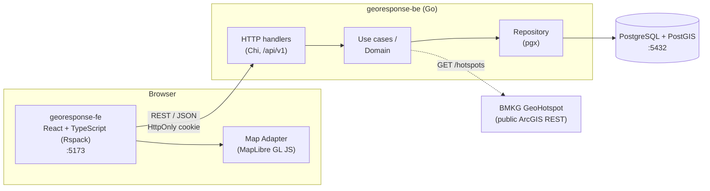
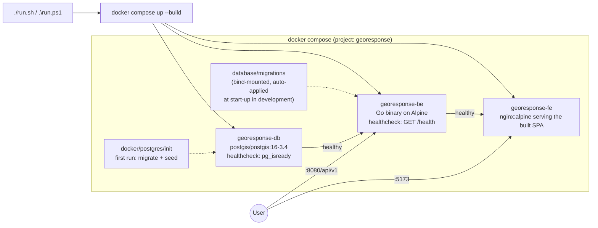
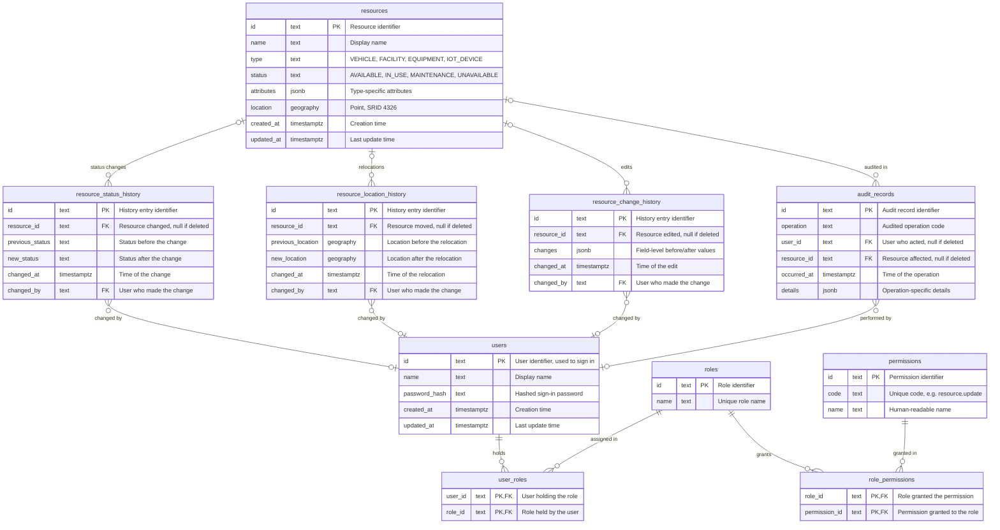
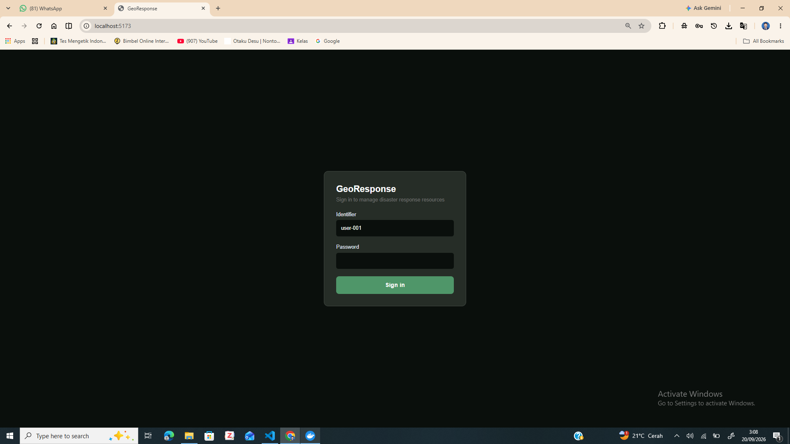
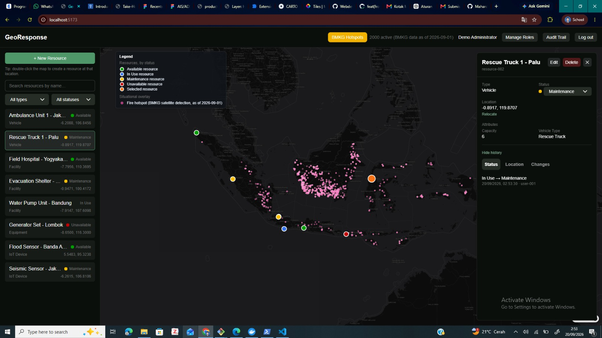

<div align="center">
  <h1>GeoResponse</h1>
  <p><strong>Geospatial resource management for disaster response</strong></p>
  <p>Vehicles, facilities, equipment, and IoT devices, each with a status and a location on the map.</p>
</div>

<div align="center">
  
  
  
  
  
  
</div>

## For Reviewers

The take-home brief asks the documentation to cover three things. Each one
has its own section in this README:

| Brief requirement | Where it is answered |
|---|---|
| How to run the program | [Run with Docker](#run-with-docker) (one command) and [Run Locally](#run-locally) |
| Why these libraries were chosen | [Technology Stack](#technology-stack) |
| How far agentic AI was used | [AI-Assisted Development](#ai-assisted-development) |

## Table of Contents

1. [About GeoResponse](#about-georesponse)
2. [Implementation Status](#implementation-status)
3. [Architecture Overview](#architecture-overview)
4. [Technology Stack](#technology-stack)
5. [Setup](#setup)
6. [Run with Docker](#run-with-docker)
7. [Run Locally](#run-locally)
8. [Demo Accounts](#demo-accounts)
9. [Demo Screenshots](#demo-screenshots)
10. [Testing](#testing)
11. [Repository Structure](#repository-structure)
12. [Documentation](#documentation)
13. [AI-Assisted Development](#ai-assisted-development)
14. [Contributors](#contributors)
15. [License](#license)

## About GeoResponse

During disaster response, coordinators need to know which vehicles,
facilities, equipment, and IoT devices are available, where they are, and
what condition they are in. Without a central system, that information is
scattered and hard to trust.

GeoResponse manages these as **Resource** records. Each resource has an
identity, a type, type-specific attributes, an operational status, and a
geographic location. Location is a core part of the data model, not an
optional field.

With GeoResponse, users can:

- See every resource on an interactive MapLibre map and in a synchronized
  list, with search by name and filters by type and status.
- Open a resource to see its attributes, current status, coordinates, and its
  full status, location, and change history.
- Create resources (from a form or by double-clicking the map), update them,
  and delete them. The backend validates every write.
- Move a resource between `AVAILABLE`, `IN_USE`, `MAINTENANCE`, and
  `UNAVAILABLE`.
- Relocate a resource while keeping its identity, type, and history.
- Sign in with a cookie-based session. Roles and permissions control each
  operation, and a read-only coordinator role is seeded.
- Browse an audit trail of every write, filtered by user and resource.
- Turn on an optional overlay of BMKG GeoHotspot fire hotspots on the same
  map.

Product rationale and users are in
[`docs/01_product/PRODUCT_CONTEXT.md`](docs/01_product/PRODUCT_CONTEXT.md), and
what is in and out of scope is in
[`docs/01_product/SCOPE.md`](docs/01_product/SCOPE.md).
The precise definition of a Resource and its lifecycle is in
[`docs/01_product/DOMAIN_MODEL.md`](docs/01_product/DOMAIN_MODEL.md).

## Implementation Status

GeoResponse is implemented end to end and runs with one command (see
[Run with Docker](#run-with-docker)).

- **Backend** (`georesponse-be/`): the full `/api/v1` surface in
  [`docs/04_contracts/API_CONTRACT.md`](docs/04_contracts/API_CONTRACT.md).
  That covers resource CRUD, status change, relocation, history,
  search/filter/pagination, cookie-based authentication, role and permission
  management, the audit trail, the BMKG GeoHotspot overlay endpoint, and
  `GET /health`. Configuration is validated at start-up, so the process
  refuses to start on a missing or malformed variable. With
  `APP_ENV=development`, pending migrations are applied before the port is
  bound.
- **Frontend** (`georesponse-fe/`): login, the resource list and MapLibre map
  (behind the Map Adapter), search and filters, the detail card, create (form
  or map double-click), update, status change, relocate, delete, history,
  role management, the audit trail view, and the hotspot overlay.
- **Database** (`database/`): seven migration pairs and three seed files
  (sample resources plus the two [demo accounts](#demo-accounts)).
- **Containerization**: multi-stage `Dockerfile`s for both apps, a root
  `docker-compose.yml` (PostGIS with first-run migration and seeding, the
  backend with a healthcheck, and the nginx-served frontend), `run.sh` /
  `run.ps1`, and the `scripts/docker/` and `scripts/deployment/` scripts.
- **Tests**: unit tests colocated with the code (Go `testing`; Vitest and
  React Testing Library), an API integration suite in `tests/integration/`
  that runs in CI against a PostGIS service container, and a Playwright
  golden-path test in `tests/e2e/` that runs locally against the composed
  stack.
- **CI** (`.github/workflows/ci.yml`): frontend lint, type-check, build, and
  test; backend fmt, vet, build, and test; the integration job; and a Docker
  build check for both images.

**Not implemented at this scope** (see
[`docs/01_product/SCOPE.md`](docs/01_product/SCOPE.md) and
[`docs/05_engineering/TECHNOLOGY_SELECTION.md`](docs/05_engineering/TECHNOLOGY_SELECTION.md)):
deployment to a hosted environment, continuous deployment, TLS termination, a
container registry, and running the e2e suite in CI.

**Partial**: role create, rename, and delete are available through the API
only; the list and map show only the first page of 20 resources; and the map
has no dedicated empty state. These items and a few endpoint-level contract
deviations are listed in `docs/01_product/SCOPE.md` section 11 and
`docs/04_contracts/API_CONTRACT.md` section 19. The checkbox-level record of
every phase, including which checks ran in which environment, is in
[`IMPLEMENTATION_CHECKLIST.md`](IMPLEMENTATION_CHECKLIST.md).

## Architecture Overview

GeoResponse is a **modular monolith**: one React + TypeScript frontend, one Go
backend, and one PostgreSQL + PostGIS database, with dependencies pointing in
one direction only. Full detail is in
[`docs/03_architecture/SYSTEM_ARCHITECTURE.md`](docs/03_architecture/SYSTEM_ARCHITECTURE.md).

### Local Project Architecture


```mermaid
flowchart LR
    subgraph Browser
        FE["georesponse-fe<br/>React + TypeScript (Rspack)<br/>:5173"]
        MA["Map Adapter<br/>(MapLibre GL JS)"]
        FE --> MA
    end
    subgraph Backend["georesponse-be (Go)"]
        H["HTTP handlers<br/>(Chi, /api/v1)"] --> U["Use cases /<br/>Domain"] --> R["Repository<br/>(pgx)"]
    end
    DB[("PostgreSQL + PostGIS<br/>:5432")]
    BMKG["BMKG GeoHotspot<br/>(public ArcGIS REST)"]
    FE -- "REST / JSON<br/>HttpOnly cookie" --> H
    R --> DB
    U -. "GET /hotspots" .-> BMKG
```

### Docker Project Architecture


```mermaid
flowchart LR
    RUN["./run.sh  /  .\run.ps1"] --> C["docker compose up --build"]
    C --> DB
    C --> BE
    C --> FE
    subgraph Compose["docker compose (project: georesponse)"]
        DB["georesponse-db<br/>postgis/postgis:16-3.4<br/>healthcheck: pg_isready"]
        BE["georesponse-be<br/>Go binary on Alpine<br/>healthcheck: GET /health"]
        FE["georesponse-fe<br/>nginx:alpine serving the built SPA"]
        INIT["docker/postgres/init<br/>first run: migrate + seed"] -.-> DB
        MIG["database/migrations<br/>(bind-mounted, auto-applied<br/>at start-up in development)"] -.-> BE
        DB -- "healthy" --> BE -- "healthy" --> FE
    end
    U((User)) -- ":5173" --> FE
    U -- ":8080/api/v1" --> BE
```

### Database Schema


```mermaid
erDiagram
    %% Rows are written as: column, type, key, description. The column name
    %% deliberately occupies Mermaid's type slot so it renders leftmost.
    resources {
        id            text         PK  "Resource identifier"
        name          text             "Display name"
        type          text             "VEHICLE, FACILITY, EQUIPMENT, IOT_DEVICE"
        status        text             "AVAILABLE, IN_USE, MAINTENANCE, UNAVAILABLE"
        attributes    jsonb            "Type-specific attributes"
        location      geography        "Point, SRID 4326"
        created_at    timestamptz      "Creation time"
        updated_at    timestamptz      "Last update time"
    }
    resource_status_history {
        id               text         PK  "History entry identifier"
        resource_id      text         FK  "Resource changed, null if deleted"
        previous_status  text             "Status before the change"
        new_status       text             "Status after the change"
        changed_at       timestamptz      "Time of the change"
        changed_by       text         FK  "User who made the change"
    }
    resource_location_history {
        id                 text         PK  "History entry identifier"
        resource_id        text         FK  "Resource moved, null if deleted"
        previous_location  geography        "Location before the relocation"
        new_location       geography        "Location after the relocation"
        changed_at         timestamptz      "Time of the relocation"
        changed_by         text         FK  "User who made the change"
    }
    resource_change_history {
        id           text         PK  "History entry identifier"
        resource_id  text         FK  "Resource edited, null if deleted"
        changes      jsonb            "Field-level before/after values"
        changed_at   timestamptz      "Time of the edit"
        changed_by   text         FK  "User who made the change"
    }
    audit_records {
        id           text         PK  "Audit record identifier"
        operation    text             "Audited operation code"
        user_id      text         FK  "User who acted, null if deleted"
        resource_id  text         FK  "Resource affected, null if deleted"
        occurred_at  timestamptz      "Time of the operation"
        details      jsonb            "Operation-specific details"
    }
    users {
        id             text         PK  "User identifier, used to sign in"
        name           text             "Display name"
        password_hash  text             "Hashed sign-in password"
        created_at     timestamptz      "Creation time"
        updated_at     timestamptz      "Last update time"
    }
    user_roles {
        user_id  text  PK, FK  "User holding the role"
        role_id  text  PK, FK  "Role held by the user"
    }
    roles {
        id    text  PK  "Role identifier"
        name  text      "Unique role name"
    }
    role_permissions {
        role_id        text  PK, FK  "Role granted the permission"
        permission_id  text  PK, FK  "Permission granted to the role"
    }
    permissions {
        id    text  PK  "Permission identifier"
        code  text      "Unique code, e.g. resource.update"
        name  text      "Human-readable name"
    }

    resources |o--o{ resource_status_history : "status changes"
    resources |o--o{ resource_location_history : "relocations"
    resources |o--o{ resource_change_history : "edits"
    resources |o--o{ audit_records : "audited in"
    resource_status_history }o--o| users : "changed by"
    resource_location_history }o--o| users : "changed by"
    resource_change_history }o--o| users : "changed by"
    audit_records }o--o| users : "performed by"
    users ||--o{ user_roles : "holds"
    roles ||--o{ user_roles : "assigned in"
    roles ||--o{ role_permissions : "grants"
    permissions ||--o{ role_permissions : "granted in"
```

Migrations and seeds live in [`database/`](database/). The full schema is
specified in [`docs/08_database/DATABASE_SCHEMA.md`](docs/08_database/DATABASE_SCHEMA.md).

## Technology Stack

Each choice was weighed against the realistic alternatives for this
application. The short version:

| Area | Choice | Instead of | Why it fits GeoResponse |
|---|---|---|---|
| Frontend | React + TypeScript | (required) | Required by the brief |
| Build tool | Rspack | Vite, webpack | webpack-style config (`DefinePlugin` for build-time values) with a fast Rust toolchain; unlike Vite, the same bundler runs in dev and production |
| Map | MapLibre GL JS | Leaflet, OpenLayers | In the benchmark its render time stayed flat from 100 to 10,000 features, while Leaflet slowed about 50x and OpenLayers about 90x; the resource map plus hotspot overlay can grow fast during a response |
| Backend | Go | (required) | Required by the brief |
| HTTP routing | Chi + `net/http` | Standard `ServeMux`, Gin / Echo | Route groups with per-group auth middleware, so no protected route can miss its auth check; handlers stay plain `net/http`, unlike Gin or Echo |
| API | REST + JSON at `/api/v1` | GraphQL, gRPC-Web | One browser client with fixed screens; one endpoint per operation maps cleanly to one permission and a clear HTTP status |
| Database | PostgreSQL + PostGIS | PostgreSQL with lat/lng columns, MongoDB | Users, roles, history, and audit need foreign keys and constraints; locations need a real geographic type and spatial index |
| Data access | pgx with SQL | GORM, sqlc | PostGIS expressions are plain SQL; GORM has no geography type and sqlc adds a code generation step |
| Server state | TanStack Query | `useEffect` + `fetch`, SWR | List refresh after every write, optimistic relocation with rollback, and hotspot polling come built in |
| Client state | `useState` / `useReducer` | Redux Toolkit, Zustand | The only client state (selection, filters, modals) is local to one page; a store would invite duplicating API data |
| Styling | Tailwind CSS v4 | CSS Modules, MUI / Ant Design | Custom map-first layout with one shared color palette for list, markers, and legend, without a heavy component library on top of MapLibre |
| Frontend tests | Vitest + React Testing Library | Jest | TypeScript and ES modules work without extra transform setup, with the same Jest-style API |
| Backend tests | Go `testing` | testify, Ginkgo | Table-driven tests and `httptest` cover everything; no extra dependency |
| End-to-end tests | Playwright | Cypress, Selenium | Drives a real browser against the composed stack, frontend and API on different ports, with little setup |
| Containers and CI | Docker Compose, nginx, GitHub Actions | Kubernetes | One-command local stack and automated checks on every push; no hosted cluster is needed at this scope |

The full comparison for each decision is in
[`docs/05_engineering/TECHNOLOGY_SELECTION.md`](docs/05_engineering/TECHNOLOGY_SELECTION.md):
what the application needs, why each alternative fits less well, and the
trade-off accepted. The same file lists the technologies left out on purpose
(gRPC as the primary API, microservices, Kubernetes, Redis, message brokers).
The map benchmark methodology and raw results are in
[`geo-map-benchmark/docs/`](geo-map-benchmark/docs/). The benchmark is a
standalone sub-project and is not part of the running application.

## Setup

1. Clone the repository:

   ```bash
   git clone https://github.com/MahardikaPratama/georesponse.git
   cd georesponse
   ```

2. Create the environment files. There are three `.env.example` files: one
   at the root (used by Compose), one in `georesponse-fe/`, and one in
   `georesponse-be/`. The Docker run script copies each one to `.env` if it
   does not exist yet, so the Docker path needs no manual step. For the local
   path, copy them yourself:

   ```bash
   cp .env.example .env
   cp georesponse-fe/.env.example georesponse-fe/.env
   cp georesponse-be/.env.example georesponse-be/.env
   ```

3. Change values only if a default conflicts with your machine, for example a
   port that is already in use. The defaults are fake local-development
   placeholders. `.env` files are gitignored and must never be committed.
   Every variable is documented in
   [`docs/11_devops/ENVIRONMENT_MANAGEMENT.md`](docs/11_devops/ENVIRONMENT_MANAGEMENT.md).

## Run with Docker

The only prerequisite is Docker (Docker Desktop, or Docker Engine with the
Compose v2 plugin), installed and running. You can download it from
[docker.com](https://www.docker.com/products/docker-desktop).

```bash
./run.sh        # macOS / Linux
```

```powershell
.\run.ps1       # Windows (PowerShell)
```

The script checks Docker, creates any missing `.env` files, and builds both
images. It then starts PostgreSQL + PostGIS, the backend, and the frontend in
that order, each waiting for the previous one to be healthy. On a new database
volume it also migrates and seeds the database. When everything is up, it
prints the URLs:

| Service | URL |
|---|---|
| Frontend | <http://localhost:5173> |
| Backend API | <http://localhost:8080/api/v1> |
| Health check | <http://localhost:8080/health> |

Other useful commands:

```bash
./run.sh --foreground      # stay attached to the compose logs (.\run.ps1 -Foreground)
./run.sh --down            # stop the stack and keep the database volume (.\run.ps1 -Down)
docker compose down -v     # stop and drop the database volume; the next run re-migrates and re-seeds
docker compose up --build  # the same stack without the wrapper script
```

How the stack is wired is described in
[`docs/11_devops/DOCKER_COMPOSE.md`](docs/11_devops/DOCKER_COMPOSE.md), and the
images in
[`docs/11_devops/CONTAINERIZATION.md`](docs/11_devops/CONTAINERIZATION.md).

## Run Locally

Use this path for day-to-day development with hot reload. You need:

- [Go 1.26+](https://go.dev/dl/)
- [Node.js 20+ and npm](https://nodejs.org/en/download/)
- PostgreSQL 15+ with PostGIS. The simplest option is to run only the
  database from the compose file:

  ```bash
  docker compose up -d georesponse-db
  ```

After the [Setup](#setup) steps, start the backend and frontend in two
terminals:

```bash
cd georesponse-be
set -a && source .env && set +a     # load .env into the shell (PowerShell: see georesponse-be/README.md)
go run ./cmd/api                    # applies pending migrations, then serves on :8080
```

```bash
cd georesponse-fe
npm install
npm run dev                         # http://localhost:5173 with hot reload
```

If you use a native PostgreSQL instead of the compose database, apply the
schema and seeds once with the scripts. They need the `migrate` CLI and
`psql`.

```bash
scripts/database/migrate.sh         # Windows: scripts\database\migrate.ps1
scripts/database/seed.sh            # Windows: scripts\database\seed.ps1
```

Per-application details are in
[`georesponse-be/README.md`](georesponse-be/README.md) and
[`georesponse-fe/README.md`](georesponse-fe/README.md).

## Demo Accounts

There is no hosted demo. Run the stack locally and open
<http://localhost:5173>. The seed data includes two accounts for local
development only:

| Role | Identifier | Password | Access |
|---|---|---|---|
| Administrator | `user-001` | `ChangeMe123!` | Full access |
| Response Coordinator | `user-002` | `ChangeMe123!` | Read-only; every write returns 403 |

Permissions per role and where the accounts come from are listed in
[`DEMO_ACCOUNTS.md`](DEMO_ACCOUNTS.md).

## Demo Screenshots

The sign-in screen and the main map and resource list view, running locally:

<div align="center">
  
  
</div>

## Testing

```bash
scripts/dev/test.sh                                              # frontend + backend unit tests (test.ps1 on Windows)
GEORESPONSE_API_URL=http://localhost:8080 scripts/dev/test.sh    # also runs tests/integration/ against a running stack
cd tests/e2e && npm install && npm run install-browsers && npm test   # Playwright golden path (needs a running stack)
scripts/quality/check.sh                                         # every quality gate (lint, type-check, build, vet, test)
```

Unit tests sit next to the code they test. The integration suite (Go,
black-box HTTP) and the e2e suite (Playwright) need a running stack; see
[`tests/README.md`](tests/README.md). The overall strategy is in
[`docs/05_engineering/TESTING_STRATEGY.md`](docs/05_engineering/TESTING_STRATEGY.md).

## Repository Structure

```text
georesponse/
├── georesponse-fe/              # React + TypeScript frontend (Rspack, MapLibre behind a Map Adapter)
├── georesponse-be/              # Go backend (REST API at /api/v1)
├── database/                    # SQL migrations (NNNN_*.up/down.sql) and seed data
├── docker/postgres/init/        # First-run migration and seed hook for the compose database
├── docker-compose.yml           # Full local stack: PostGIS, backend, frontend
├── run.sh / run.ps1             # One-command local run
├── scripts/                     # dev/, database/, docker/, deployment/, quality/ (.sh + .ps1 pairs)
├── tests/                       # integration/ (Go, API) and e2e/ (Playwright) suites
├── geo-map-benchmark/           # Standalone benchmark: Leaflet vs OpenLayers vs MapLibre GL JS
├── docs/                        # Project specification and engineering docs (01_product to 13_ai)
├── IMPLEMENTATION_CHECKLIST.md  # Checkbox-level record of what was built and verified
├── DEMO_ACCOUNTS.md             # Demo accounts (local development only)
├── AGENTS.md / CLAUDE.md        # Operating rules for AI coding agents in this repository
└── README.md                    # This file
```

## Documentation

The `docs/` tree is the project specification. It was written before the
implementation and takes priority over assumptions made while coding. The
folders are numbered in a sensible reading order:

| Folder | Covers |
|---|---|
| `01_product/` | Product context, domain model, scope, use cases, business rules |
| `02_requirements/` | Functional and non-functional requirements |
| `03_architecture/` | System architecture, dependency rules, architecture decision records |
| `04_contracts/` | API contract and data contract between frontend and backend |
| `05_engineering/` | Technology selection, coding standards, testing strategy, security, observability |
| `06_frontend/` | Frontend architecture, naming, state, testing, UI/UX |
| `07_backend/` | Backend architecture, naming, validation, dependencies, error handling, testing |
| `08_database/` | Database architecture, schema, migrations, operations |
| `09_quality/` | Code quality rules and quality gates |
| `10_git/` | Git management and pull request guidelines |
| `11_devops/` | Docker Compose, containerization, deployment, environments, release management, CI/CD |
| `12_workflow/` | Development workflow and definition of done |
| `13_ai/` | AI operation rules and the AI-assisted workflow |

Folders `01` to `04` describe what the product must do and how the system is
shaped. Folders `05` onward describe how to build it.

## AI-Assisted Development

This project was built with Claude Code, an agentic AI coding tool, using a
spec-driven workflow designed and run by Mahardika Pratama. The author
decided what to build and how the work would be done. The AI drafted most of
the documents and code within that process. Nothing was committed without
the author's review.

### How the Workflow Runs

1. **Spec first.** The author defines the product scope, requirements, and
   the structure of `docs/`. The AI drafts each document, and the author
   reviews and corrects it until it is accepted as the source of truth.
2. **Rules for the agent.** `AGENTS.md`, `CLAUDE.md`, and `docs/13_ai/` tell
   the agent what it may and may not do: follow the docs in a fixed order of
   precedence, stay inside the architecture boundaries, never add excluded
   technology, and never report a check that did not run.
3. **Phase by phase.** `IMPLEMENTATION_CHECKLIST.md` splits the build into
   phases. For each phase, the AI drafts code, tests, and doc updates
   against the specs.
4. **Review and decide.** The author reviews every change, makes the
   technical decisions the specs leave open, and sends work back for
   revision until it is right.
5. **Verify honestly.** Checks are run and reported as what actually ran.
   Anything that could not be run is marked unverified in the checklist
   instead of being checked off.

### Who Did What

| Area | Mahardika Pratama (author) | AI (Claude Code) |
|---|---|---|
| Process | Designed the spec-driven development workflow, the `docs/` structure, the source-of-truth precedence, and the operating rules for the agent | Followed that workflow and those rules |
| Product and scope | Defined the product, scope, requirements, and what to defer or leave out | Drafted the product, requirement, and design documents from those decisions |
| Technical decisions | Chose the module path, migration tool, dependencies, and UI behavior | Proposed options and implemented the chosen ones |
| Implementation | Directed each phase | Drafted the backend layers, frontend features, migrations and seeds, map benchmark harness, containerization, CI, and test suites |
| Review | Reviewed all docs and code before commit, and directed revisions | Revised the work based on review feedback, and ran cross-document consistency checks |
| Verification | Accepted results and decided what still counted as unverified | Ran `go build`, `go vet`, `gofmt`, `go test`, `npm run lint`, `typecheck`, `build`, `test`, live database runs, `docker compose up --build`, and the integration suite, and reported the results as they were |
| Responsibility | Responsible for everything that became part of the project | None; all output was accepted or rejected by the author |

The rules the agent followed are in
[`docs/13_ai/AI_OPERATION_RULES.md`](docs/13_ai/AI_OPERATION_RULES.md). The
working procedure and the full disclosure, phase by phase, are in
[`docs/13_ai/AI_WORKFLOW.md`](docs/13_ai/AI_WORKFLOW.md) (section 5).

## Contributors

<div align="center">
  <a href="https://github.com/MahardikaPratama">
    
  </a>
  <br />
  <a href="https://github.com/MahardikaPratama"><strong>Mahardika Pratama</strong></a>
</div>

## License

This repository is a take-home technical test submission by Mahardika Pratama.
No open-source license is granted at this time. All rights are reserved
unless the author states otherwise.
